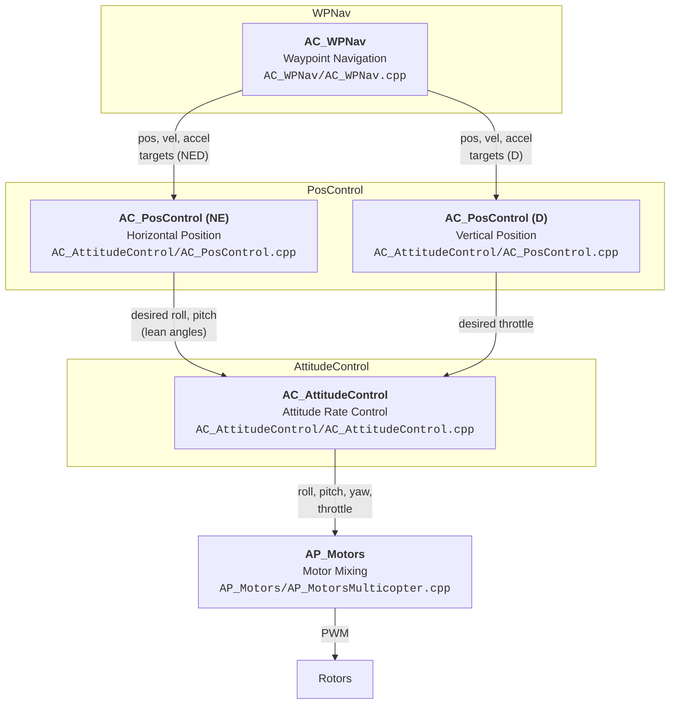
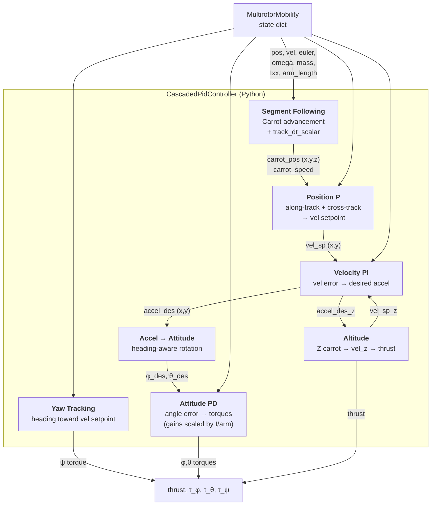

# Cascaded PID Trajectory Controller

This document describes `CascadedPidController`
(`pymodules/controllers/cascaded_pid.py`) and how it relates to
ArduCopter's navigation and position control stack.

## 1. ArduCopter Architecture

ArduCopter uses a layered cascade where higher-level navigation
modules generate position/velocity/acceleration targets, and
lower-level controllers track those targets down to motor commands.

Source references are relative to
`ardupilot-Copter-4.6.2/libraries/`.

### 1.1 Control Cascade

### 1.2 AC_PosControl — Horizontal (NE)

**Source:** `AC_AttitudeControl/AC_PosControl.h` (class definition),
`AC_AttitudeControl/AC_PosControl.cpp` (`input_pos_vel_accel_NE_m`,
`NE_update_controller`).

The horizontal position controller is a P → PID cascade. The position
P controller converts position error to a desired velocity correction:

$$
\mathbf{v}_{\text{des}} = K_{p,\text{pos}} \cdot (\mathbf{p}_{\text{target}} - \mathbf{p})
$$

The velocity PID adds this correction to the feedforward velocity
from WPNav and produces a desired acceleration:

$$
\mathbf{a}_{\text{des}} = \mathbf{a}_{\text{ff}}
  + K_{p,\text{vel}} \cdot \mathbf{e}_v
  + K_{i,\text{vel}} \int \mathbf{e}_v \, dt
  + K_{d,\text{vel}} \dot{\mathbf{e}}_v
$$

Desired horizontal acceleration is converted to lean angles via
`accel_NE_mss_to_lean_angles_rad()`, clamped to `ANGLE_MAX`
(default 45°).

| Parameter | Default | Source |
|-----------|---------|--------|
| `PSC_POSXY_P` | 1.0 | `AC_PosControl.h` `_p_pos_ne_m` |
| `PSC_VELXY_P` | 1.0 | `AC_PosControl.h` `_pid_vel_ne_m` |
| `PSC_VELXY_I` | 0.5 | `AC_PosControl.h` `_pid_vel_ne_m` |
| `PSC_VELXY_D` | 0.5 | `AC_PosControl.h` `_pid_vel_ne_m` (20 Hz LP filter) |
| Max speed | 5.0 m/s | `POSCONTROL_SPEED_MS` |
| Max accel | 1.0 m/s² | `POSCONTROL_ACCEL_NE_MSS` |
| Max jerk | 5.0 m/s³ | `POSCONTROL_JERK_NE_MSSS` |

### 1.3 AC_PosControl — Vertical (D)

**Source:** `AC_AttitudeControl/AC_PosControl.cpp`
(`input_pos_vel_accel_D_m`, `D_update_controller`).

Three stages — position P → velocity P → acceleration PID:

$$
v_{z,\text{des}} = K_{p,\text{pos}_z} \cdot (z_{\text{target}} - z)
$$

$$
a_{z,\text{des}} = a_{z,\text{ff}} + K_{p,\text{vel}_z} \cdot e_{v_z}
$$

$$
\delta_{\text{throttle}} = K_{p,\text{acc}_z} \cdot e_{a_z}
  + K_{i,\text{acc}_z} \int e_{a_z} \, dt
  + K_{d,\text{acc}_z} \dot{e}_{a_z}
$$

| Parameter | Default | Source |
|-----------|---------|--------|
| Max climb | 2.5 m/s | `POSCONTROL_SPEED_UP_MS` |
| Max descent | 1.5 m/s | `POSCONTROL_SPEED_DOWN_MS` |
| Max accel | 2.5 m/s² | `POSCONTROL_ACCEL_D_MSS` |

### 1.4 AC_AttitudeControl

**Source:** `AC_AttitudeControl/AC_AttitudeControl.cpp`
(`input_euler_angle_roll_pitch_euler_rate_yaw`,
`rate_controller_run`).

Per-axis P → PID cascade. The angle P controller uses a square-root
response curve for large errors. The rate PID has a 20 Hz low-pass
filter on the D term.

### 1.5 AC_WPNav — Segment Following

**Source:** `AC_WPNav/AC_WPNav.cpp`
(`advance_wp_target_along_track`).

WPNav does **not** point the vehicle toward the waypoint. It advances
a "carrot" target along a pre-computed S-curve trajectory between
waypoints and feeds PosControl a (position, velocity, acceleration)
triplet.

#### Track time scaling

The carrot advancement rate is modulated by `track_dt_scalar`, which
slows the carrot when the vehicle is behind or off-track:

$$
\alpha_{\text{track}} = \text{clamp}\!\left(
  0.05 + \frac{v_{\text{track}} - K_{p,\text{pos}} \cdot e_{\text{track}}}{|\mathbf{v}_{\text{des}}|},
  \; 0, \; 1
\right)
$$

This is exponentially filtered with time constant
$\tau = a_{\text{max}} / j_{\text{max}}$.

#### Velocity shaping and carrot advancement

Cruise speed is shaped with jerk-limited acceleration
(`shape_vel_accel`), producing a velocity scaling factor
$\alpha_{\text{vel}}$. The effective time step is:

$$
\Delta t_{\text{eff}} = \alpha_{\text{track}} \cdot \alpha_{\text{vel}} \cdot \Delta t
$$

The S-curve generator advances the carrot by $\Delta t_{\text{eff}}$,
producing $(\mathbf{p}, \mathbf{v}, \mathbf{a})$ targets. Velocity
and acceleration targets are scaled by $\alpha_{\text{vel}}$ and
$\alpha_{\text{vel}}^2$ respectively before being sent to PosControl.

A waypoint is reached when the S-curve finishes **and** the vehicle is
within `WP_RADIUS` of the destination.

---

## 2. Our Implementation

### 2.1 Architecture

### 2.2 Comparison with ArduCopter

**What we keep:**

| Feature | ArduCopter source | Our implementation |
|---------|-------------------|-------------------|
| Segment following with carrot | `AC_WPNav::advance_wp_target_along_track()` | Same concept — carrot advances along segment |
| Track time scaling | `track_dt_scalar` in `AC_WPNav.cpp` | Same formula with separate `Kp_track` (see below) |
| Position P → velocity | `AC_PosControl::_p_pos_ne_m` | Same, `Kp_pos = 1.0` matching `PSC_POSXY_P` |
| Velocity → acceleration | `AC_PosControl::_pid_vel_ne_m` | PI only (no D term) |
| Accel → lean angles | `accel_NE_mss_to_lean_angles_rad()` | Heading-aware rotation, then small-angle approx |
| Feedforward velocity | `set_pos_vel_accel_NED_m()` | Along-track feedforward + P correction |

**Where we simplify:**

| Feature | ArduCopter | Our simplification | Rationale |
|---------|-----------|-------------------|-----------|
| Speed profile | Jerk-limited S-curve (`SCurve` class) | Trapezoidal (accel-limited) | Sufficient for simulation |
| Velocity D term | `PSC_VELXY_D = 0.5` (20 Hz filtered) | Omitted | No sensor noise; drag provides implicit damping |
| Attitude control | P on angle → PID on rate (two loops) | Combined PD on angle+rate | Clean dynamics (no noise) |
| Spline waypoints | `AC_WPNav::_spline_this_leg` | Straight-line segments | Our corridors are straight |
| Motor mixing | `AP_Motors` per-motor PWM | Direct thrust + torques | Dynamics model accepts (T, τ) |
| Altitude accel PID | `_pid_accel_d_m` → throttle | `T = m(g + a_z)` | Known mass; no calibration |
| Corner transitions | S-curve blending | Stop-and-go at waypoints | Acceptable for simulation |
| Track scaling gain | `PSC_POSXY_P` for both | Separate `Kp_track = 0.5` | Our max tilt (28°) vs ArduCopter (45°) |
| Cross-track clamp | Total speed clamp | Independent 15% of cruise | ArduCopter's D term damps this instead |
| Attitude gain scaling | Fixed per-vehicle tune | `Kp = Kp_base * Ixx / arm` | Consistent response without per-vehicle tuning |

### 2.3 Algorithm

For each segment from $\mathbf{w}_{i-1}$ to $\mathbf{w}_i$ with
length $L$ and unit direction $\hat{\mathbf{t}}$:

**1. Trapezoidal speed profile:**

$$
v_c \leftarrow \min(v_c + a_{\max} \Delta t, \; v_{\text{cruise}}, \; \sqrt{2 a_{\max}(L - s)})
$$

**2. Track time scaling** (from `AC_WPNav.cpp`):

$$
v_{\text{track}} = \mathbf{v} \cdot \hat{\mathbf{t}}, \quad
e_{\text{track}} = s - (\mathbf{p} - \mathbf{w}_{i-1}) \cdot \hat{\mathbf{t}}
$$

$$
\alpha = \text{clamp}\!\left(
  0.05 + \frac{v_{\text{track}} - K_{p,\text{track}} \cdot e_{\text{track}}}{v_c},
  \; 0, \; 1
\right)
$$

Exponentially filtered with $\tau = 0.5\text{s}$.

**3. Advance carrot:**

$$
s \leftarrow s + v_c \cdot \alpha \cdot \Delta t, \qquad
\mathbf{p}_{\text{carrot}} = \mathbf{w}_{i-1} + \tfrac{s}{L}(\mathbf{w}_i - \mathbf{w}_{i-1})
$$

**4. Velocity setpoint** (feedforward + along/cross-track
decomposition):

$$
v_{\text{along}} = \text{clamp}(v_c \alpha + K_{p,\text{pos}} \cdot e_{\text{along}}, \; 0, \; v_{\text{cruise}})
$$

$$
\mathbf{v}_{\text{cross}} = K_{p,\text{pos}} \cdot \mathbf{e}_{\text{cross}}, \quad
|\mathbf{v}_{\text{cross}}| \le 0.15 \, v_{\text{cruise}}
$$

$$
\mathbf{v}_{\text{sp}} = v_{\text{along}} \hat{\mathbf{t}} + \mathbf{v}_{\text{cross}}
$$

**5. Velocity PI** (analogous to `AC_PosControl::_pid_vel_ne_m`
without D term):

$$
\mathbf{a}_{\text{des}} = K_{p,\text{vel}} \cdot (\mathbf{v}_{\text{sp}} - \mathbf{v})
  + K_{i,\text{vel}} \int (\mathbf{v}_{\text{sp}} - \mathbf{v}) \, dt
$$

**6. Accel → attitude** (heading-aware, analogous to
`accel_NE_mss_to_lean_angles_rad`):

$$
a_{b,x} = a_{x} \cos\psi + a_{y} \sin\psi, \quad
a_{b,y} = -a_{x} \sin\psi + a_{y} \cos\psi
$$

$$
\theta_{\text{des}} = a_{b,x}/g, \quad
\phi_{\text{des}} = -a_{b,y}/g, \quad
T = m(g + a_{z})
$$

**7. Attitude PD** (gains scaled by $I_{xx}/L_{\text{arm}}$ for
airframe-independent angular response):

$$
\tau_\phi = K_{p} (\phi_{\text{des}} - \phi) - K_{d} \, p, \quad
\tau_\theta = K_{p} (\theta_{\text{des}} - \theta) - K_{d} \, q
$$

**8. Yaw:** track $\psi_{\text{des}} = \text{atan2}(v_{sp,y}, v_{sp,x})$
with PD.

**9. Segment switch:** when $s \ge L$, reset $s = 0$, $v_c = 0$,
advance to next segment. At final waypoint, enter hover mode.

### 2.4 Parameters

| Parameter | Symbol | Value | ArduCopter equivalent |
|-----------|--------|-------|----------------------|
| Position P | $K_{p,\text{pos}}$ | 1.0 | `PSC_POSXY_P` = 1.0 |
| Track scaling P | $K_{p,\text{track}}$ | 0.5 | (uses `PSC_POSXY_P`) |
| Velocity P (XY) | $K_{p,\text{vel}}$ | 2.0 | `PSC_VELXY_P` = 1.0 |
| Velocity I (XY) | $K_{i,\text{vel}}$ | 0.2 | `PSC_VELXY_I` = 0.5 |
| Velocity P (Z) | $K_{p,\text{vel}_z}$ | 4.0 | `PSC_VELZ_P` |
| Velocity I (Z) | $K_{i,\text{vel}_z}$ | 0.5 | `PSC_VELZ_I` |
| Angle P (base) | $K_{p,\text{ang}}$ | 20.0 | `ATC_ANG_*_P` |
| Angle D (base) | $K_{d,\text{ang}}$ | 8.0 | `ATC_RAT_*_D` |
| Max acceleration | $a_{\max}$ | 5.0 m/s² | `POSCONTROL_ACCEL_NE_MSS` = 1.0 |
| Max tilt | $\theta_{\max}$ | 0.5 rad | `ANGLE_MAX` = 45° |
| Cross-track clamp | — | 15% of cruise | (total speed clamp in ArduCopter) |
| Acceptance radius | — | 3.0 m | `WP_RADIUS` |

### 2.5 Hover Mode

When the final waypoint is reached, the controller switches to
position-hold:

- Target position fixed at the final waypoint
- Velocity setpoint = $K_{p,\text{pos}} \cdot (\mathbf{w}_{\text{final}} - \mathbf{p})$, clamped to 2 m/s
- Integral accumulators reset
- Yaw rate damped only

### 2.6 Effect of Aerodynamic Drag

The dynamics model includes quadratic translational drag and linear
rotational damping (see `docs/multirotor_dynamics.md`). This affects
the controller in two ways:

1. **Implicit velocity damping.** Drag acts as a natural D-term on
   velocity, reducing oscillation at turns and during hover. This is
   why we omit `PSC_VELXY_D` — drag provides equivalent damping
   without the noise-sensitivity issues of a derivative term.

2. **Reduced effective acceleration.** At high speed, drag opposes
   thrust-induced acceleration, so the effective max lateral
   acceleration is lower than $g \tan\theta_{\max}$.