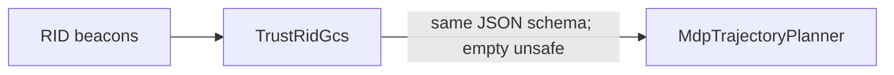

# Spoofing-Aware with Planning

Simulation entry point for decentralized trajectory planning under broadcast RID and an optional spoofing-aware GCS.

## SpoofingAware vs TrustRID

| | **SpoofingAware** (`SpoofingAwareGcs`) | **TrustRID baseline** (`TrustRidGcs`) |
|--|--|--|
| **Benign aircraft** | `pymodules.controllers.mdp_trajectory_planner.MdpTrajectoryPlanner` | **Same** |
| **Spoofing detection** | Combined KF-NIS / RSSI MLAT alert | None |
| **Localization / IMM** | Multilateration + IMM → chance-constraint ellipsoid | None |
| **`unsafe_region(s)`** in `gcs_command` | Published from estimate | Always empty |
| **`other_positions`** | **Benign** cooperative tracks only — **detected spoofers omitted** (claims are adversarial junk); separation from attacker uses **`unsafe_region(s)`** / localized estimate. Env `ULI_GCS_MDP_INCLUDE_CLAIMED_SPOOFERS=1` optionally adds junk-claim repulsion for ablations. | **All** RID tracks including spoofer **claimed** position — TrustRID trusts broadcasts (no ellipsoid) |

Both planners receive the **same JSON command shape** (`unsafe_region`, `unsafe_regions`, `other_positions`, `goal`, …). TrustRID is intentionally the **same decentralized MDP planner**—only the GCS algorithm and broadcast content differ. NMAC summaries still use **ground truth** from `GcsModule` when present.

INI: `Scenario_*` uses SpoofingAware by default; `Scenario_*_TrustRid` extends the same scenario and swaps `*.gcs[0].pyClass` to `TrustRidGcs` (and may override spoofer `pyTxClass` for stress offsets—see `omnetpp.ini`).

## Scenario families (spoofer path shape)

In `omnetpp.ini`, benign traffic and waypoint scripts differ by scenario family; **`Scenario_*_TrustRid`** inherits **identical** benign + spoofer kinematics—only GCS (+ optional beacon offset class) changes.

- **`Scenario_Hub_*` (4×1, 8×1, 12×1):** spoofer straight **east–west** at **y = 250 m** across Hub configs.
- **`Scenario_Circle_8x1`, `Scenario_SteepZ_8x1`, `Scenario_Corners_4x1`:** diagonal / piecewise path. **`Scenario_Corners_4x1_SmoothSpoofer`** adds intermediate waypoints for smoother turns.

**DepotCity_*×1:** compact delivery layout; spoofer leg documented in-file (constant-altitude segment). **`Scenario_DepotCity_*_TrustRid`** inherits the parent scenario verbatim except **`TrustRidGcs`** — same kinematics and **`PositionOffsetSpooferNegZ`** RID offset as **`Scenario_DepotCity_*x1`**. Non-Depot **`Scenario_*_TrustRid`** configs may still override **`PositionOffsetSpooferTrustRidCollisionBias`** in `omnetpp.ini` for stronger TrustRID stress (`pymodules/spoofers/position_offset.py`).

## End-to-end flow — SpoofingAware

```mermaid
flowchart TD
  A["`omnetpp.ini` scenario"] --> B["Network hosts"]
  B --> C["Benign: `MdpTrajectoryPlanner`"]
  B --> D["Spoofer: `CascadedPidController` + offset `pyTxClass`"]
  C --> E["RID beacons → RX reports"]
  D --> E
  E --> F["`SpoofingAwareGcs.on_gcs_reports`"]
  F --> G["Detection: combined KF-NIS ∨ MLAT score"]
  G -->|"alert"| H["IMM + RSSI localization"]
  H --> I["`on_gcs_tick`: ellipsoid publish + metrics"]
  I --> C
```

Detection/localization detail (KF branch, MLAT thresholds, IMM, smoothing) matches `spoofing_aware_gcs.py` module docstring and the **Runtime behavior** section below.

## End-to-end flow — TrustRID baseline



Reports still populate **`rid_positions`** for cooperative **`other_positions`**; there is **no** spoofing detector, **no** multilateration tracker, **no** published unsafe region—only claimed positions and goals drive separation behavior.

## Runtime behavior (SpoofingAware)

### Reports (`on_gcs_reports`)

Each transmission carries `serial_number`, `claimed_pos`, and RX `reports` (`pos`, `rssi_dbm`, optional `kf_nis`). Unknown serials are screened until first spoofer lock (`STOP_DETECTION_AFTER_FIRST_SPOOFER` default).

### Detection (pre-declaration)

Combined rule per report: `kf_max_nis > 6.63` **or** smoothed MLAT score `> 50`. MLAT path uses `RssiMultilaterationDetector` (≥4 RX), joint NLLS, error KF → `mlat_score`.

### Handoff → localization

On alert: serial enters `spoofers`, IMM + TX initialization from accumulated samples; ongoing joint (≥4 RX) or position-only (≥3 RX) solves from `multilateration.py`; IMM correction on reports, predict between ticks.

### Tick (`on_gcs_tick`)

Chance-constraint ellipsoid(s) from IMM `(mu, Σ, alpha)`, smoothed/clamped; stale primary rebroadcast if needed. Per benign federate command: `unsafe_region`, `unsafe_regions`, **`other_positions`** (benign RID only—spoofer excluded), `goal`, `alpha`, `agent_radius`.

### MDP (`MdpTrajectoryPlanner`)

Soft value terms around risk + **hard** rejection if any forward sample enters the ellipsoid (`chance_constraint.ellipsoid_threshold`). Same code path whether GCS is SpoofingAware or TrustRID; inputs differ per table above.

### Chance constraint

`pymodules/gcs/chance_constraint.py`: chi-square threshold in 3D, Mahalanobis tests shared by GCS metrics and planner feasibility.

## Files

### Scenario / run

| Path | Purpose |
|------|---------|
| `simulations/spoofing_aware_with_planning/omnetpp.ini` | Scenarios, `pyClass`, mobility class bindings |
| `datagen/spoofting_aware_trajectory_planning_datagen/run_spoofing_aware_trajectory_planning_batch.sh` | Batch driver (paired runs, plots) |
| `datagen/run_batch.py`, `datagen/run_scenario.py` | Generic batch / single-scenario execution |
| `datagen/spoofting_aware_trajectory_planning_datagen/run_spoofing_aware_trajectory_planning_batch_README.md` | Batch runbook |

### Python loaded by INI

| Module | Role |
|--------|------|
| `pymodules/planners/spoofing_aware_gcs.py` | Detection, IMM, unsafe regions |
| `pymodules/planners/trust_rid_gcs.py` | RID-trust baseline; empty unsafe regions |
| `pymodules/controllers/mdp_trajectory_planner.py` | **Shared** benign decentralized planner |
| `pymodules/controllers/cascaded_pid.py` | Spoofer low-level control |
| `pymodules/spoofers/position_offset.py` | Claimed-position offset hooks |

Supporting: `detectors/*`, `gcs/multilateration.py`, `gcs/imm_estimator.py`, `gcs/chance_constraint.py`.

### Analysis

| Path | Purpose |
|------|---------|
| `pymodules/analysis/spoofing_batch_metrics.py` | Paired Aware / TrustRID `.sca` summaries |
| `datagen/spoofting_aware_trajectory_planning_datagen/plot_batch.py` | Charts / tables |

## Output layout

Under `simulations/spoofing_aware_with_planning/batches/<run-id>/`:

- `generated/` — scenario dirs, INIs, results, parquet, `.sca`
- `summary.csv` — paired scalars (Aware vs TrustRID)
- `gcs_vectors/` — exported GCS vectors
- `charts/` — PDFs / tables
- `run_timing.csv` — wall-clock timing

Folder name `spoofting_aware_trajectory_planning_datagen` is historical; paths above match the repo.
